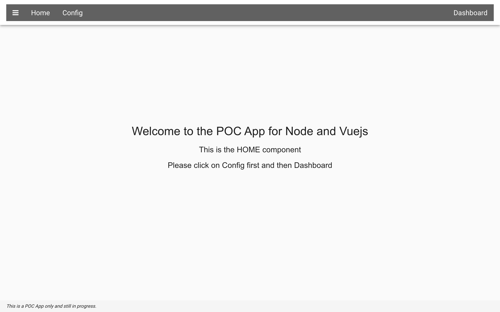
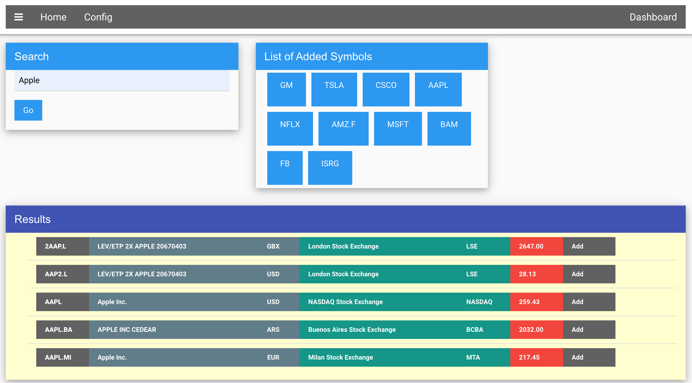
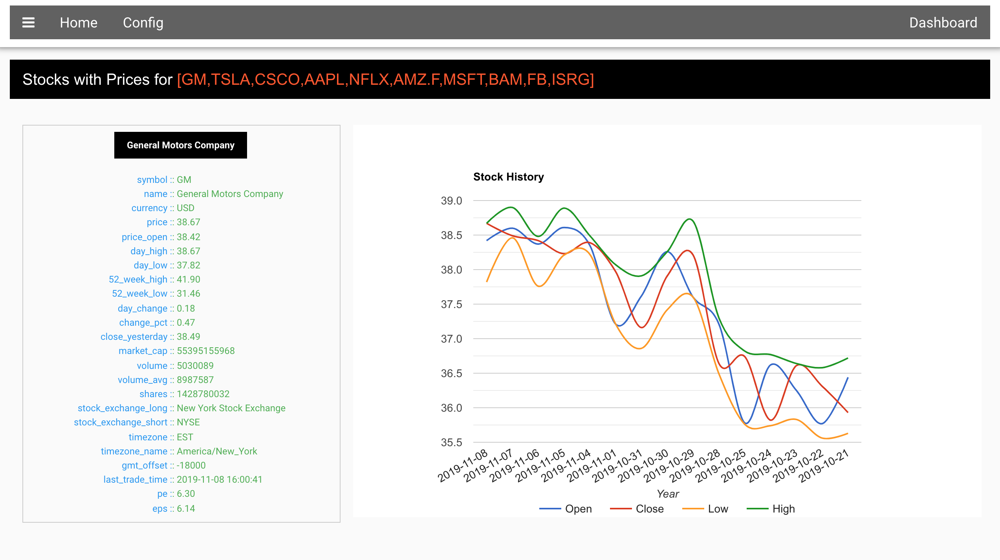

# fullstack-javascript
This repository contains example apps on Stock Market data. 

There is one backend app as of now : server-express and two client side apps : client-vue and client-vue-vuex. As the name suggests the first client app has the same features but with plain Vuejs and no Vuex. Second client app includes local stprage with Vuex and Vuetify integration also for UI elements.

Steps:
1. You will need to get your own key and set it in server-express/.env file
2. Run npm install in server-expres and run it through npm run api
3. Run npm install and run it through yarn serve
4. Install Redis on your local system

HOME Component
# 

Configuration Component
# 

Charts Component (using google charts here)
# 

